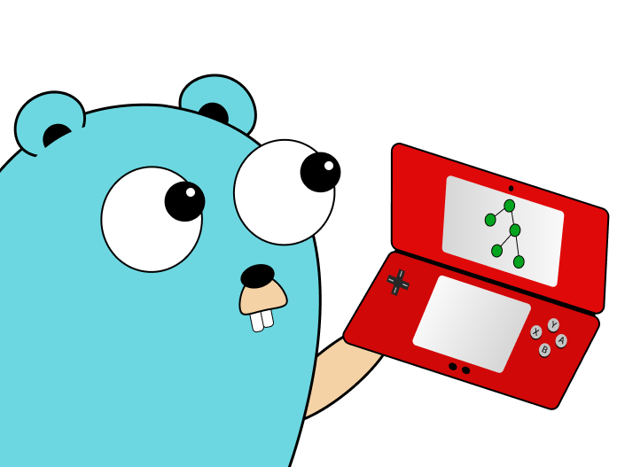

## ds

ds (short for data structures) is an easy to use, light weight library for implementing various generic data structures such as BSTs, tries, and linked lists in Golang.

### Current data structures and methods:
* Binary Search Tree
    * Insert(key int, data T) bool
    * Search(key int) (T, bool)
    * Remove(key int) (*treeNode[T], bool)
    * PrintInOrder() string
    * PrintPreOrder() string
    * PrintPostOrder() string
* Hash Table
    * Insert(key string, value T) bool
    * Search(key string) (T, bool)
    * Delete(key string) (T, bool)
* Heap
* Linked List
* Queue
* Stack
* Trie